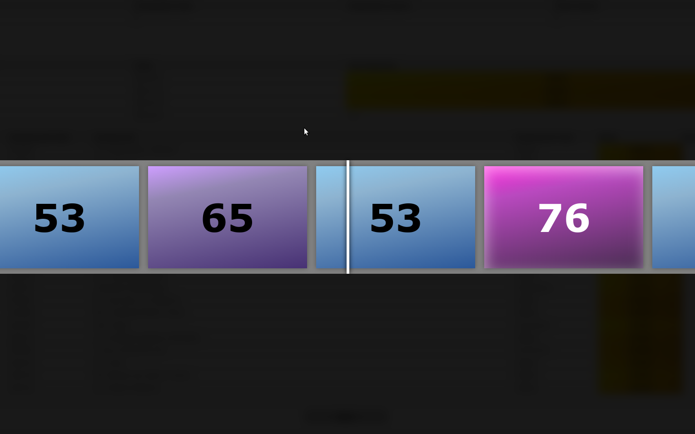
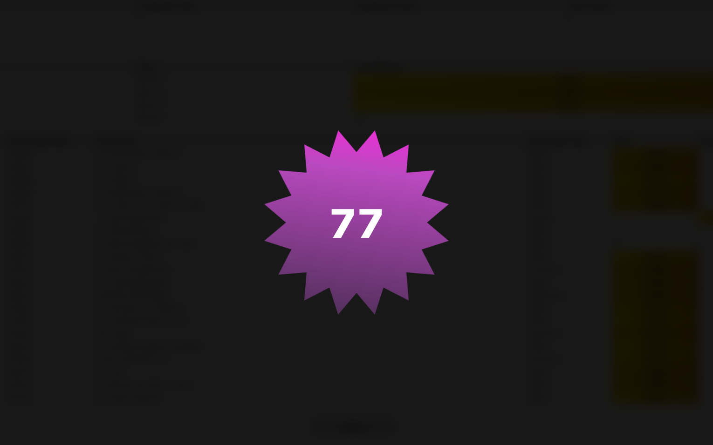

# Oxunbox

An addon to let you reveal your Oxford exam results in Student Self-Service using a sort of spin-the-wheel system.

## Installation

You can install this addon from the web store of your choice.

* Chrome: https://chromewebstore.google.com/detail/oxunbox/jcanmcdhpdnkmokdnoflojmpanibagjo
* Firefox: https://addons.mozilla.org/en-GB/firefox/addon/oxunbox/

## Manual installation from source

Download this repository from the link at the top of the page. Then:

### Chrome

1. Go to `about:extensions`
1. Toggle the 'developer mode' switch in the top-right corner
1. Click the 'load unpacked' button
1. Select the `src` folder which you downloaded

### Firefox

1. Go to `about:debugging`
1. Select 'This Firefox' in the menu on the left 
1. Click the 'load temporary addon' button
1. Select the downloaded `src/manifest.json` file

## Contributing

Pull requests & bug reports are welcome. 

